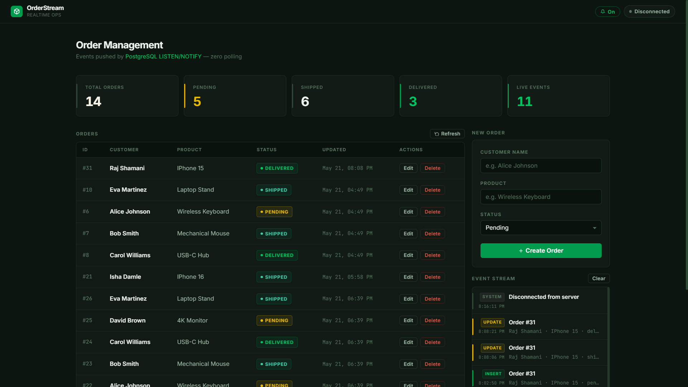

# 📦 Realtime Orders System

A **production-grade, event-driven real-time order tracking backend** built with Node.js, Express.js, PostgreSQL, and Socket.IO.

Changes to the `orders` table are instantly broadcast to all connected clients — with **zero polling**.

---

## Screenshots & Demo

This section demonstrates the real-time event-driven architecture in action. Multiple connected clients receive live updates instantly whenever database changes occur through PostgreSQL LISTEN/NOTIFY and Socket.IO broadcasting.

### Main Dashboard


### Real-Time Sync Across Tabs


### PostgreSQL Database / pgAdmin View


### Terminal Showing Server Startup Logs


### Real-Time INSERT Event Demo


### Real-Time UPDATE Event Demo


### Real-Time DELETE Event Demo


### Socket.IO Client Connection Logs


---

# 📋 Approach

This section maps the implementation of the Realtime Orders System directly to the assignment evaluation criteria, demonstrating production-grade design decisions, technical correctness, robust code quality, and comprehensive documentation.

## 1. Design(Scalability & Efficiency)

The architecture of this system is designed to handle high-throughput database modifications while maintaining minimal system resource usage and sub-millisecond event propagation latency.

### The Decision: PostgreSQL `LISTEN/NOTIFY` vs. Traditional Polling
*   **Why polling was intentionally avoided:** Traditional polling mechanisms (e.g., clients query the HTTP server, or the backend queries the database on a `setInterval` loop) introduce massive inefficiencies. At scale, thousands of concurrent requests execute redundant `SELECT * FROM orders` queries, overwhelming the database CPU, generating unnecessary network traffic, consuming connection slots, and bloating database transaction logs—even when no data changes.
*   **Why PostgreSQL `LISTEN/NOTIFY` was chosen:** This built-in feature serves as a native, database-level publish-subscribe (Pub/Sub) system. By leveraging PostgreSQL triggers calling `pg_notify()`, events are dispatched directly inside the database transaction engine. When a row changes, the database instantly pushes a lightweight JSON payload over a dedicated socket connection to the application server. The application server remains completely idle until an actual database event occurs, resulting in **zero unnecessary database load**.
*   **Event-Driven Communication & Low-Latency Propagation:** By relying on events rather than interval timers, updates propagate with sub-millisecond latency. An order modification immediately pushes the change down the pipeline, bypassing any poll-delay queues.
*   **Reduced Server Overhead & Efficient Resource Utilization:** Because the Node.js event loop only reacts to incoming push notifications, memory usage remains flat, and CPU cycles are reserved exclusively for serving active requests and handling connected WebSockets.
*   **Separation of API Query Pool and Realtime Listener Connection:**
    *   **HTTP/REST Connection Pool:** Traditional CRUD operations are served by a standard `pg.Pool` client pool configured with a maximum connection limit (`max: 10`). These connections are transient—they are acquired from the pool, execute a query, and are immediately released back to the pool to maximize throughput.
    *   **Dedicated Realtime Listener Client:** Since standard pool connections cannot reliably maintain an active, long-lived `LISTEN` state (as they are recycled and shared across async REST requests), we allocate a **dedicated, single `pg.Client` connection** purely for the listener (`pgListener.js`). This client initiates the persistent `LISTEN orders_channel` channel binding and runs in its own connection lifecycle, leaving the REST connection pool fully unblocked.
*   **Decoupled & Modular Architecture:** The Socket.IO websocket engine, PostgreSQL listener, database configuration, Express routers, and business logic controllers are entirely decoupled. This separation of concerns ensures that modifications to the database layer do not ripple into the transport layer, greatly improving maintainability.

### Future Scalability & Production Migration Pathways
While the current architecture is extremely lightweight and efficient for single-server setups, it is built with future scale in mind:
1.  **Horizontal Scaling with Redis Pub/Sub:** In a multi-instance backend deployment (e.g., autoscaling on Kubernetes or ECS), WebSocket clients are scattered across different servers. By plugging in `@socket.io/redis-adapter` backed by a Redis Pub/Sub cluster, a database event received by any Node.js instance is instantly replicated across all other nodes, ensuring global synchronization across all connected clients.
2.  **Enterprise Event Bus Migration (Apache Kafka):** For microservice environments, the database trigger can be migrated to a Change Data Capture (CDC) tool like Debezium. Debezium streams low-level transaction logs directly to an Apache Kafka cluster. The backend then consumes from a Kafka topic instead of PostgreSQL `LISTEN`, enabling high-volume stream processing, out-of-order event handling, message persistence, and replayability.

---

## 2. Correctness (Real-Time Update Accuracy)

Real-time synchronization correctness is guaranteed at the database transaction layer rather than the application code layer, eliminating race conditions and missed updates.

*   **Database-Level Trigger Enforcement:** We employ a PL/pgSQL database trigger (`orders_change_trigger`) attached to the `orders` table. Because it is configured as `AFTER INSERT OR UPDATE OR DELETE FOR EACH ROW`, it is impossible for an order to be modified in the database without an event firing. The trigger automatically constructs a standardized JSON envelope containing:
    *   `operation`: The exact SQL verb that occurred (`INSERT`, `UPDATE`, or `DELETE`).
    *   `data`: The entire serialized row representation (`NEW` for writes/updates, `OLD` for deletes).
    *   `timestamp`: The high-precision database server clock timestamp.
*   **Guaranteed Event Propagation via `pg_notify()`:** Unlike application-level notification attempts (which can fail if a database query succeeds but the node process crashes before broadcasting), PostgreSQL only dispatches the `pg_notify` payload if the enclosing database transaction successfully commits. If a transaction rolls back, no event is emitted, guaranteeing 100% data consistency.
*   **Instant Node.js Event Handlers:** The dedicated pg listener receives the notification instantly through the `notification` event of the `pg` client. The payload is parsed, and Socket.IO broadcasts it to all active clients in a single tick.
*   **Multi-Tab Synchronization Proof:** Because Socket.IO establishes a persistent bi-directional channel, updates are pushed concurrently to all active socket connections. A user opening multiple browser tabs or clients will observe identical, synchronized updates in real time without any page refreshes or manual trigger operations.

### Realtime Testing
1. Open multiple browser tabs connected to the application (http://localhost:3000).
2. Perform INSERT, UPDATE, or DELETE operations (via the dashboard's creation form, REST client, or direct PostgreSQL updates).
3. Observe instant synchronization across all clients.
4. Verify that updates propagate without page refreshes.

This demonstration verifies:
*   **realtime correctness:** The UI perfectly reflects database state changes.
*   **consistency:** Every client tab transitions to the identical database state.
*   **low latency propagation:** Delays are imperceptible to the end user.

---

## 3. Code Quality (Clean Architecture & Maintainability)

The codebase is built following professional software engineering design patterns, enforcing a clean separation of concerns, high maintainability, and enterprise-grade error resilience.

### Modular Backend Structure
The project is strictly structured to avoid spaghetti code, placing distinct responsibilities in designated modules:
*   **Controllers:** House the business logic for CRUD operations. They interface with the database pool and format standardized API envelopes.
*   **Routes:** Define the REST endpoints, mapping HTTP verbs and paths directly to specific controller methods.
*   **Websocket:** Manages the Socket.IO server setup, connection lifecycles, and maintains the active websocket state as a clean singleton.
*   **Listeners:** Contains the PostgreSQL listen broker. It maintains the persistent connection and pipes incoming database events to the Socket.IO manager.
*   **Middleware:** Handles global operational steps, including input validation (`validate.js`) and error mapping (`errorHandler.js`).
*   **Config Separation:** Separates database connections, connection pools, and strict environment configuration (`env.js`).

### Engineering Best Practices
*   **Separation of Concerns:** Controllers do not know about WebSocket channels; they simply query the database. The database trigger handles the event generation, and the `pgListener` acts as a clean bridge between PostgreSQL and Socket.IO.
*   **Reusable Controllers:** Clean REST controller functions represent simple, reusable operations over the database that do not hold transient transport-level code.
*   **Robust Async/Await Code Structure:** All database operations and async workflows utilize ES6 `async/await` syntax wrapped in robust `try/catch` logic blocks to eliminate unhandled promise rejections.
*   **Centralized Error Handling:** All errors are caught and piped to a centralized Express error-handling middleware (`errorHandler.js`). Database-specific errors (e.g., foreign key violations, invalid data types) are normalized into clean, secure JSON error responses, keeping raw stack traces hidden from clients.
*   **Validation Middleware:** Utilizing `express-validator`, all incoming request bodies are validated before reaching the controllers. If a validation check fails (e.g., empty customer name or unsupported order status), the middleware immediately aborts the pipeline with an informative `422 Unprocessable Entity` response, ensuring invalid database entries are rejected upstream.
*   **Environment Variable Management:** All runtime variables are handled centrally in `config/env.js`. If a critical environment variable (like `DB_PASSWORD` or `DB_NAME`) is missing, the server throws an explicit, informative startup error and terminates immediately, preventing undefined state crashes during execution.
*   **Logging Using Morgan:** Standard HTTP logging is integrated using `morgan` in development, outputting structured method, path, response status, and duration logs to the console for rapid debugging.
*   **Graceful Shutdown Handling:** In a production container (e.g., Docker), stopping the service sends a `SIGTERM` or `SIGINT` signal. The server captures these signals and gracefully closes the HTTP server, terminates active WebSockets, closes the database connection pool, and closes the persistent pg listener connection cleanly before exiting.
*   **Reconnection Handling for PostgreSQL Listeners:** If the PostgreSQL server restarts or drops its connection (e.g., network blip, cloud failover), the dedicated pg listener detects the disconnect, schedules exponential backoff reconnect attempts, and automatically re-establishes the `LISTEN` channel, ensuring high availability and zero manual intervention.

These practices significantly improve the **readability** of the source code, simplify future feature **maintainability**, streamline troubleshooting and **debugging** of edge cases, and ensure seamless **extensibility** for future development.

---


---

## 🏗️ Architecture Overview

```
┌─────────────────────────────────────────────────────────────────┐
│  Browser Client (Socket.IO)                                     │
│   • Connects via WebSocket                                      │
│   • Listens for "orderUpdated" events                           │
└──────────────────────────┬──────────────────────────────────────┘
                           │  WebSocket (Socket.IO)
┌──────────────────────────▼──────────────────────────────────────┐
│  Node.js / Express Server                                       │
│  ┌─────────────────┐   ┌─────────────────────────────────────┐  │
│  │  REST API        │   │  pgListener (LISTEN/NOTIFY bridge)  │  │
│  │  GET /api/orders │   │  • Dedicated pg.Client              │  │
│  │  POST            │   │  • LISTEN orders_channel            │  │
│  │  PUT             │   │  • On notification → broadcast()    │  │
│  │  DELETE          │   └──────────────┬──────────────────────┘  │
│  └────────┬─────────┘                 │                         │
│           │  SQL (pool)               │  notification event     │
└───────────┼───────────────────────────┼─────────────────────────┘
            │                           │
┌───────────▼───────────────────────────▼─────────────────────────┐
│  PostgreSQL                                                     │
│  ┌───────────────────────────────────────────────────────────┐  │
│  │  orders table                                             │  │
│  │  ← INSERT / UPDATE / DELETE                               │  │
│  │      ↓ (trigger fires)                                    │  │
│  │  notify_orders_change()                                   │  │
│  │      ↓                                                    │  │
│  │  pg_notify('orders_channel', json_payload)                │  │
│  └───────────────────────────────────────────────────────────┘  │
└─────────────────────────────────────────────────────────────────┘
```

---

## ❓ Why LISTEN/NOTIFY instead of polling?

| Concern | Polling (`setInterval`) | LISTEN/NOTIFY |
|---|---|---|
| **Latency** | Up to poll interval (e.g. 5 s) | Sub-millisecond |
| **DB load** | Constant SELECT queries | Zero extra queries |
| **CPU usage** | Always running | Idle until event |
| **Missed events** | Possible between polls | None — push-based |
| **Scalability** | Degrades with client count | Constant overhead |
| **Complexity** | State diffing needed | No diffing needed |

PostgreSQL LISTEN/NOTIFY is a **built-in publish-subscribe mechanism**. When a trigger calls `pg_notify()`, PostgreSQL pushes the message to every connection currently listening on that channel. The `pg` Node.js driver surfaces these as native `notification` events — no polling, no timers, no wasted cycles.

---

## ⚡ Real-time Event Flow (step by step)

1. A REST client calls `POST /api/orders` (or PUT / DELETE).
2. The Express controller executes the SQL against the connection pool.
3. PostgreSQL commits the row and **automatically fires** `orders_change_trigger`.
4. The trigger function builds a JSON payload and calls `pg_notify('orders_channel', payload)`.
5. The dedicated `pg.Client` inside `pgListener.js` receives a `notification` event.
6. `pgListener` parses the JSON and calls `socketManager.broadcast('orderUpdated', payload)`.
7. Socket.IO emits `orderUpdated` to every browser tab connected to the `orders` room.
8. The browser updates the UI table in real time — **no page refresh, no polling**.

---

## 📁 Project Structure

```
realtime-orders-system/
│
├── server/
│   ├── config/
│   │   ├── db.js           # pg Pool + dedicated listener client factory
│   │   └── env.js          # Centralised environment variable config
│   │
│   ├── controllers/
│   │   └── ordersController.js   # CRUD handlers (getAllOrders, createOrder, …)
│   │
│   ├── routes/
│   │   └── ordersRoutes.js       # Express Router — maps verbs to handlers
│   │
│   ├── websocket/
│   │   └── socketManager.js      # Socket.IO init, singleton io, broadcast()
│   │
│   ├── listeners/
│   │   └── pgListener.js         # LISTEN/NOTIFY bridge with auto-reconnect
│   │
│   ├── middleware/
│   │   ├── errorHandler.js       # Centralised error + 404 handlers
│   │   └── validate.js           # express-validator chains
│   │
│   ├── triggers/
│   │   └── orders_trigger.sql    # Schema + trigger function + trigger
│   │
│   ├── app.js                    # Express app factory
│   └── server.js                 # Entry point — HTTP server + boot sequence
│
├── client/
│   └── index.html                # Browser dashboard (Socket.IO + REST)
│
├── .env                          # Environment variables (never commit!)
├── package.json
└── README.md
```

---

# 🐳 Running with Docker

For the most robust, reproducible, and frictionless developer onboarding experience, this system is fully containerized using **Docker** and **Docker Compose**. 

By running with Docker, you can spin up the entire multi-container topology—including the Node.js backend server and a PostgreSQL database pre-configured with triggers, schemas, and seed rows—using a single command:

```bash
docker compose up --build
```

---

## ⚙️ Docker Architecture Overview

The multi-container orchestration is connected via an isolated virtual bridge network, ensuring that container communication is fast, secure, and isolated from host machine port collisions.

```
┌────────────────────────────────────────────────────────┐
│                    Client Browser                      │
│               (Dashboard UI & Rest API)                │
└──────────────────────────┬─────────────────────────────┘
                           │ Ports: HTTP (3000) / WebSocket
                           ▼
┌────────────────────────────────────────────────────────┐
│               Node.js Backend Container                │
│             (Name: realtime_orders_backend)            │
│  - Mounts: Host directory for nodemon dev reload       │
│  - Ports: Exposes 3000 to Host                         │
└──────────────────────────┬─────────────────────────────┘
                           │ Internal DNS: "postgres" on Port 5432
                           ▼
┌────────────────────────────────────────────────────────┐
│                 PostgreSQL Container                   │
│               (Name: realtime_orders_db)               │
│  - Mounts: Persistent Volume (pgdata)                  │
│  - Init Script: Triggers & Schema preloaded on start  │
│  - Ports: Exposes 5432 to Host                         │
└────────────────────────────────────────────────────────┘
```

### Flow of Database-Driven Realtime Propagation:
1. **Client Action:** Client issues a standard REST API request (`POST`, `PUT`, `DELETE`) to the `backend` container on port `3000`.
2. **Database Commit:** The Node.js `backend` service runs the DML operation on the database container via the host `postgres` at internal port `5432`.
3. **Trigger Event:** PostgreSQL commits the transaction and immediately executes `notify_orders_change()` trigger, calling `pg_notify('orders_channel', payload)`.
4. **Listener Dispatch:** The Node.js dedicated pg connection (listening internally inside the container) catches the `pg_notify` event instantly.
5. **WebSocket Broadcast:** The Node.js server broadcasts the parsed JSON payload to all active Socket.IO connections (across different browser tabs) instantly.

---

## 🏗️ Technical Advantages of Using Docker

Implementing a containerized workflow provides critical architectural advantages for production deployments:

*   **100% Environment Reproducibility:** Eliminates the classic *"works on my machine"* syndrome. The exact version of Node.js (v18 Alpine) and PostgreSQL (v15 Alpine) are pinned in stone, preventing conflicts stemming from local OS runtime differentials.
*   **Zero-Friction Local Onboarding:** Developers do not need to install Node.js, PostgreSQL, pgAdmin, or configure environment configurations manually. Run a single command, and the database schema, trigger functions, connection pools, and servers compile and execute out-of-the-box.
*   **Automated Schema Seeding:** Rather than requiring users to manually run script setups against their database using `psql`, the Postgres container mounts our SQL trigger file (`orders_trigger.sql`) directly to `/docker-entrypoint-initdb.d/init.sql`, running the triggers, tables, and seed rows automatically during initial database compilation.
*   **Isolated Persistent Storage:** Using named volumes (`pgdata`), data remains persistent and secure across container build sequences, updates, and service teardowns.
*   **Portability & Seamless Staging:** Docker containers are completely decoupled from host topologies. This image structure can be pushed directly to AWS ECS, Kubernetes, GCP Cloud Run, or Render with zero modification to core codebases.

---

## 🚀 Running with Docker - Step-by-Step

### Prerequisites
1. Install **Docker Desktop** on your host system:
   - [Docker Desktop for Windows](https://docs.docker.com/desktop/install/windows-install/) (Ensure WSL2 is enabled for peak performance).
   - [Docker Desktop for Mac](https://docs.docker.com/desktop/install/mac-install/) (M1/M2/Intel compatible).
   - [Docker Engine/Desktop for Linux](https://docs.docker.com/desktop/install/linux-install/).
2. Verify Docker installation:
   ```bash
   docker --version
   docker compose version
   ```

### 1. Build and Start the Entire System
Run the following command in the project root:
```bash
docker compose up --build
```
*   **What this does:**
    1. Downloads lightweight Node and Postgres Alpine base images.
    2. Builds the Node.js development container and installs all dependencies (`npm ci`).
    3. Boots the PostgreSQL service, initializes the `realtime_orders` database, applies all trigger functions, and inserts seed data.
    4. Healthcheck validates the database status and fires the backend once Postgres is ready to accept connections.
    5. Starts Nodemon watching the code files for active changes.

### 2. Access the Dashboard
Once the startup logs stabilize, navigate to **http://localhost:3000** in multiple browser tabs to test the real-time, zero-polling order updates.

### 3. Gracefully Shut Down Services
To stop the running containers without deleting the database data, run:
```bash
docker compose down
```

### 4. Full Teardown and Volume Reset
If you need to wipe out the database and start with a completely fresh state (useful if you modify schemas or triggers in `orders_trigger.sql`):
```bash
docker compose down -v
```
*(The `-v` flag deletes the named `pgdata` volume, triggering the database setup script to run fresh upon the next `docker compose up` command).*

---

## 🚀 Local Installation (Traditional/Manual Setup)

### Prerequisites

- Node.js ≥ 18
- PostgreSQL ≥ 13

### 1. Clone and install

```bash
git clone <repo-url>
cd realtime-orders-system
npm install
```

### 2. Configure environment

Edit `.env` with your PostgreSQL credentials:

```env
PORT=3000
NODE_ENV=development

DB_HOST=localhost
DB_PORT=5432
DB_USER=postgres
DB_PASSWORD=your_password_here
DB_NAME=realtime_orders
```

### 3. Create the database

```bash
psql -U postgres -c "CREATE DATABASE realtime_orders;"
```

### 4. Apply the schema + trigger

```bash
psql -U postgres -d realtime_orders -f server/triggers/orders_trigger.sql
```

This creates:
- The `orders` table
- The `notify_orders_change()` trigger function
- The `orders_change_trigger` trigger
- 5 sample rows

### 5. Start the server

```bash
# Development (auto-restart on file changes)
npm run dev

# Production
npm start
```

### 6. Open the dashboard

Navigate to **http://localhost:3000** in your browser (or multiple tabs to see real-time sync).

---

## 🧪 Testing Real-Time Functionality

Follow these steps to experience and verify the real-time synchronization capabilities of the architecture:

1. **Open multiple browser tabs** connected to the application (**http://localhost:3000**).
2. **Perform INSERT, UPDATE, or DELETE operations** on the `orders` table (either through the dashboard's "New Order" UI form, or by running query updates directly in PostgreSQL / pgAdmin).
3. **Observe live updates propagate instantly** across all connected clients in real time without manually refreshing the browser page.
4. **Verify that updates are received** through PostgreSQL LISTEN/NOTIFY and broadcasted natively via Socket.IO connections.

> [!NOTE]
> No polling or repeated database querying is used. The system follows an event-driven architecture where PostgreSQL triggers emit notifications that are propagated to clients in real time.

---

## 🔌 REST API Reference

Base URL: `http://localhost:3000/api/orders`

### GET /api/orders
Returns all orders sorted by newest first.

**Response 200**
```json
{
  "success": true,
  "count": 2,
  "data": [
    {
      "id": 1,
      "customer_name": "Alice Johnson",
      "product_name": "Wireless Keyboard",
      "status": "pending",
      "updated_at": "2024-01-15T10:30:00.000Z"
    }
  ]
}
```

---

### GET /api/orders/:id
Returns a single order.

**Response 200** — same shape as above with `"data": { ...order }` \
**Response 404** — order not found

---

### POST /api/orders
Create a new order.

**Request body**
```json
{
  "customer_name": "Bob Smith",
  "product_name": "Mechanical Mouse",
  "status": "pending"
}
```

**Response 201**
```json
{
  "success": true,
  "message": "Order created successfully",
  "data": { "id": 6, "customer_name": "Bob Smith", ... }
}
```

---

### PUT /api/orders/:id
Partially or fully update an order. All body fields are optional.

**Request body** (any subset)
```json
{
  "status": "shipped"
}
```

**Response 200**
```json
{
  "success": true,
  "message": "Order updated successfully",
  "data": { "id": 6, "status": "shipped", ... }
}
```

---

### DELETE /api/orders/:id

**Response 200**
```json
{
  "success": true,
  "message": "Order deleted successfully",
  "data": { "id": 6, ... }
}
```

---

### Error envelope (all errors)
```json
{
  "success": false,
  "error": {
    "message": "Order with id=99 not found"
  }
}
```

---

## 🧪 Postman Testing Examples

### Collection setup
Set a collection variable `base_url = http://localhost:3000/api/orders`.

### Create an order
```
POST {{base_url}}
Content-Type: application/json

{
  "customer_name": "Test User",
  "product_name": "Test Product",
  "status": "pending"
}
```

### Ship an order
```
PUT {{base_url}}/1
Content-Type: application/json

{ "status": "shipped" }
```

### Delete an order
```
DELETE {{base_url}}/1
```

---

## 🗄️ Sample SQL Queries

```sql
-- Check orders
SELECT * FROM orders ORDER BY updated_at DESC;

-- Manually trigger a notification (useful for testing the listener)
SELECT pg_notify('orders_channel',
  json_build_object(
    'operation', 'UPDATE',
    'data', row_to_json(o),
    'timestamp', NOW()
  )::text
)
FROM orders o WHERE id = 1;

-- View active LISTEN connections
SELECT pid, application_name, wait_event
FROM pg_stat_activity
WHERE wait_event = 'NotifyQueue' OR query LIKE '%LISTEN%';
```

---

## 📡 Socket.IO Events

| Event | Direction | Description |
|---|---|---|
| `connect` | Server → Client | Emitted on successful WebSocket connection |
| `connected` | Server → Client | Custom ACK with `socketId` and `timestamp` |
| `orderUpdated` | Server → Client | Fired for every INSERT/UPDATE/DELETE on `orders` |
| `disconnect` | Server → Client | Emitted on disconnection |

### `orderUpdated` payload shape
```json
{
  "operation": "INSERT",
  "data": {
    "id": 7,
    "customer_name": "Carol",
    "product_name": "USB Hub",
    "status": "pending",
    "updated_at": "2024-01-15T11:00:00.000Z"
  },
  "timestamp": "2024-01-15T11:00:00.123456"
}
```

---

## 🌐 Deployment

### Render.com

1. Push code to GitHub.
2. Create a new **Web Service** pointing to your repo.
3. Set **Build Command**: `npm install`
4. Set **Start Command**: `npm start`
5. Add environment variables in the Render dashboard (copy from `.env`).
6. Create a **PostgreSQL** database on Render and copy the connection string into `DB_*` variables.
7. Run the trigger SQL in the Render PostgreSQL shell.

### Railway.app

1. `railway init` in project root.
2. `railway add` → select PostgreSQL plugin.
3. Copy the `DATABASE_URL` and split it into individual `DB_*` vars, or use `DATABASE_URL` directly (update `db.js` to accept it).
4. `railway up`

### Environment variables for production
```env
NODE_ENV=production
PORT=3000
DB_HOST=<your-db-host>
DB_PORT=5432
DB_USER=<your-db-user>
DB_PASSWORD=<your-db-password>
DB_NAME=<your-db-name>
CORS_ORIGIN=https://your-frontend-domain.com
```

---

## 📈 Scalability Notes

- **Horizontal scaling**: Each Node.js instance needs its own LISTEN connection. For multi-instance deployments, use a Redis adapter for Socket.IO (`@socket.io/redis-adapter`) so broadcasts reach clients connected to any instance.
- **Connection pool**: The pool size (`max: 10`) can be tuned based on `max_connections` in PostgreSQL.
- **Notification payload size**: `pg_notify` has an 8 KB payload limit. The current payload (a single order row) is well within this limit.
- **Database-side**: The trigger is a lightweight plpgsql function and does not block the committing transaction.

---

## 🛡️ Security Checklist

- [ ] Set `CORS_ORIGIN` to your exact frontend domain in production (not `*`)
- [ ] Use a strong `DB_PASSWORD`
- [ ] Never commit `.env` to version control (add it to `.gitignore`)
- [ ] Add rate limiting (`express-rate-limit`) for production APIs
- [ ] Use SSL/TLS for database connections (`ssl: { rejectUnauthorized: true }` in pg config)

# Why This Approach Was Chosen

To meet the requirements of a resilient, high-performance, real-time tracking dashboard, this architecture combines native database capabilities with modern asynchronous networking primitives:

*   **PostgreSQL LISTEN/NOTIFY Provides Native Database-Level Event Propagation:** Instead of building a complex application-level queue or polling system inside Node.js, we leverage the database's own engine. PostgreSQL handles transaction commits and notification dispatch in an atomic step. This guarantees that events are only generated when transactions are fully committed, preventing out-of-sync states or ghost notifications.
*   **Socket.IO Provides Efficient Realtime Client Communication:** Socket.IO is the gold standard for bi-directional real-time communication. It automatically handles transport upgrades (falling back to long-polling if WebSockets are blocked), maintains connections with heartbeats, manages client groupings (rooms), and delivers lightweight, low-overhead event frames directly to browsers.
*   **Event-Driven Architecture Avoids Inefficient Polling:** Polling is a legacy anti-pattern for real-time dashboards. By replacing timer-based polling loops with database triggers, server overhead scales linearly with *actual database modifications* rather than *number of active users*, resulting in massive cost savings and minimal idle CPU footprint.
*   **Lightweight, Scalable, and Production-Oriented:** The solution is designed to operate on minimal server specifications while remaining robust enough to handle enterprise-level real-time flows. Decoupled services, modular code structures, and reconnection handlers ensure the service can run reliably for long durations.
*   **Real-World Architecture Alignment:** This design directly mirrors real-world event-driven backend systems, where services react to discrete database modifications, decoupling business transactions from real-time data broadcasting pipelines.

---

## 📄 License

MIT
